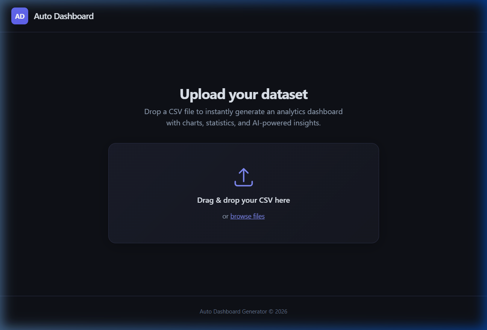
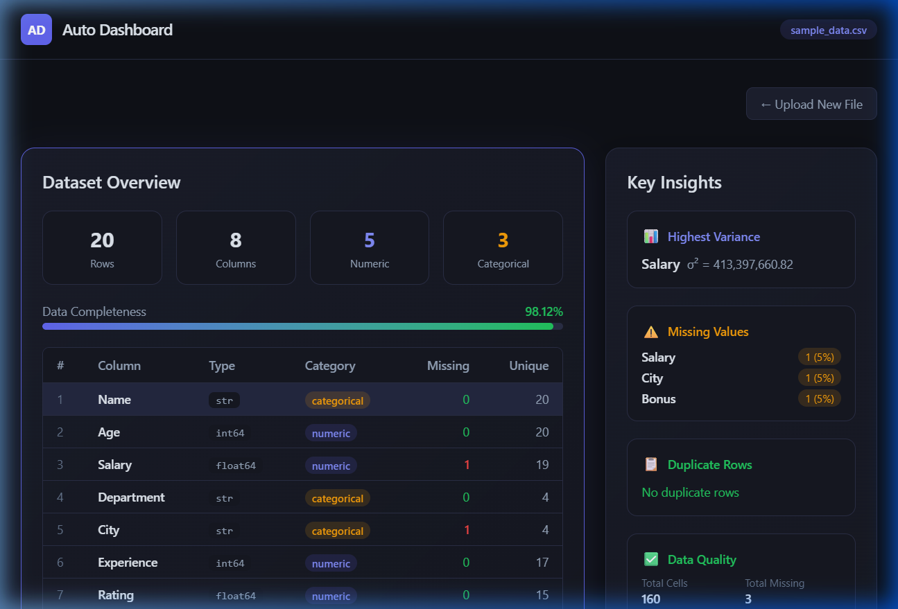
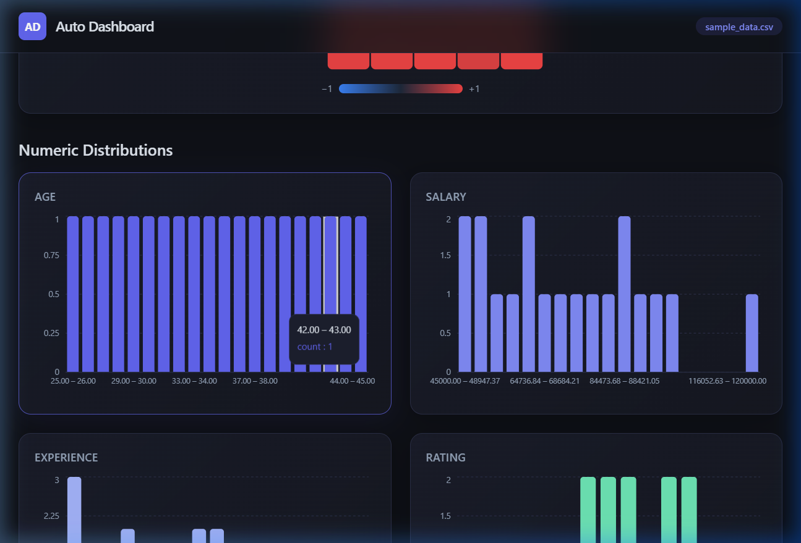

# 📊 Auto Dashboard Generator from CSV

> Upload a CSV file and instantly get a professional analytics dashboard with interactive charts, summary statistics, and auto-generated insights.


---

## ✨ Features

| Feature | Description |
|---------|-------------|
| 📁 **Drag & Drop Upload** | Upload any CSV file via drag-and-drop or file picker |
| 📋 **Dataset Summary** | Instant overview — row/column counts, data types, unique values |
| 📊 **Auto Histograms** | Distribution charts generated for every numeric column |
| 📈 **Categorical Bar Charts** | Top-N value counts visualized for categorical columns |
| 🔥 **Correlation Heatmap** | Color-coded matrix showing relationships between numeric features |
| 🔍 **Smart Insights** | Auto-detects highest variance, missing values, duplicates |
| 💯 **Data Quality Score** | Completeness percentage with visual progress bar |
| 🌙 **Dark-Themed UI** | Premium glassmorphism cards, smooth animations, responsive layout |

---

## 🖥️ Screenshots

### Upload Screen
<p align="center">
  
</p>

### Dashboard — Dataset Overview & Insights
<p align="center">
  
</p>

### Dashboard — Correlation Heatmap & Charts
<p align="center">
  
</p>

---

## 🏗️ Architecture

```
┌──────────────────┐         REST API         ┌──────────────────┐
│                  │  ──── POST /upload ────▶  │                  │
│   React + Vite   │  ──── GET /analytics ──▶  │  FastAPI + Pandas │
│   Tailwind CSS   │  ──── GET /insights ───▶  │  NumPy            │
│   Recharts       │  ◀──── JSON response ──  │                  │
└──────────────────┘                          └──────────────────┘
     Frontend                                      Backend
     Port 5173                                     Port 8000
```

---

## 📂 Project Structure

```
autodashboard/
├── backend/
│   ├── main.py              # FastAPI app — 3 endpoints
│   ├── requirements.txt     # Python dependencies
│   └── Dockerfile           # Production container
├── frontend/
│   ├── src/
│   │   ├── App.jsx           # Main orchestrator component
│   │   ├── index.css         # Tailwind v4 + custom design tokens
│   │   └── components/
│   │       ├── FileUpload.jsx         # Drag & drop uploader
│   │       ├── DatasetSummary.jsx     # Metrics, table, quality bar
│   │       ├── Histograms.jsx         # Numeric distributions
│   │       ├── BarCharts.jsx          # Categorical breakdowns
│   │       ├── CorrelationHeatmap.jsx # SVG heatmap
│   │       └── InsightsPanel.jsx      # Variance, missing, duplicates
│   ├── vite.config.js        # Dev proxy + Recharts config
│   ├── nginx.conf            # Production reverse proxy
│   ├── Dockerfile            # Multi-stage build
│   └── package.json
├── docker-compose.yml        # One-command deployment
├── sample_data.csv           # Test dataset
└── README.md
```

---

## 🚀 Quick Start

### Prerequisites
- **Python 3.11+** and **Node.js 18+**

### 1. Clone the Repository

```bash
git clone https://github.com/diwasupadhyay/AutoDashboard.git
cd AutoDashboard
```

### 2. Start the Backend

```bash
cd backend
pip install -r requirements.txt
uvicorn main:app --reload --port 8000
```

### 3. Start the Frontend

```bash
cd frontend
npm install
npm run dev
```

### 4. Open the App

Navigate to **http://localhost:5173** — upload any CSV and watch the dashboard generate!

---

## 🐳 Docker Deployment

Run the entire stack in one command:

```bash
docker-compose up --build
```

The app will be available at **http://localhost** (port 80).

---

## 🔌 API Reference

| Method | Endpoint | Description |
|--------|----------|-------------|
| `POST` | `/upload` | Upload a CSV file → returns dataset summary |
| `GET` | `/analytics` | Returns summary statistics, histograms, correlations, bar chart data |
| `GET` | `/insights` | Returns highest variance, missing values, duplicates, top categorical values |

### Example: Upload a CSV with cURL

```bash
curl -X POST -F "file=@sample_data.csv" http://localhost:8000/upload
```

---

## 🛠️ Tech Stack

| Layer | Technology | Purpose |
|-------|-----------|---------|
| Frontend | React 19, Vite 8 | Component-based UI with fast HMR |
| Styling | Tailwind CSS v4 | Utility-first CSS with custom design tokens |
| Charts | Recharts | Composable, responsive data visualizations |
| Backend | FastAPI | High-performance async Python API |
| Data | Pandas, NumPy | CSV parsing, statistics, correlation analysis |
| DevOps | Docker, Docker Compose | Containerized deployment |
| Proxy | Nginx | Static file serving + API reverse proxy |

---

## 🌐 Cloud Deployment

| Service | Component | Instructions |
|---------|-----------|-------------|
| **Render / Railway** | Backend | Deploy `backend/` as a Python web service |
| **Vercel / Netlify** | Frontend | Deploy `frontend/` — set build cmd: `npm run build`, output: `dist/` |
| **AWS / GCP** | Full Stack | Use `docker-compose up` on any VM |

> **Note:** When deploying frontend and backend separately, update the Vite proxy config or set a `VITE_API_URL` environment variable to point to your backend URL.

---

## 📝 License

This project is open-source and available under the [MIT License](LICENSE).

---

<p align="center">
  Built with ❤️ by <a href="https://github.com/diwasupadhyay">Diwas Upadhyay</a>
</p>
